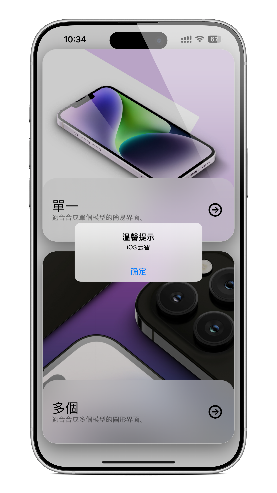

  

# iOS 弹窗项目

> English | 中文 | [繁體中文](README_ZHT.md)

这是一个 Theos tweak 项目，用于在 iOS 中注入原生弹窗。

**作者:** pxbug

## 项目结构
- `Tweak.x`: 包含弹窗逻辑和 hook 源码。
- `Makefile`: 构建配置。
- `control`: 包信息。
- `iOSAlertProject.plist`: 指定要注入的应用程序（默认: SpringBoard）。

## 预览截图

  

## 构建方法
1. 确保已安装 [Theos](https://github.com/theos/theos)。
2. 在当前目录运行 `make package`。
3. 生成的 `.deb` 文件将在 `packages/` 文件夹中。

## 自定义
- **目标应用**: 编辑 `iOSAlertProject.plist`，将 `com.apple.springboard` 改为您目标应用的 Bundle ID（例如: `com.apple.Maps`）。
- **弹窗内容**: 编辑 `Tweak.x` 来修改标题、消息或按钮。

## 注意事项
- **沙盒权限**: 某些系统 App 或具有严格沙盒限制的 App 可能会阻止注入或弹窗，但在大多数普通 App 和系统 App 中应该有效。
- **重复弹窗**: 目前逻辑是每个 App 进程生命周期内只弹一次（使用 `static BOOL hasShown`）。如果杀掉 App 重启，会再次弹窗。

---

**由 pxbug ❤️ 制作**

