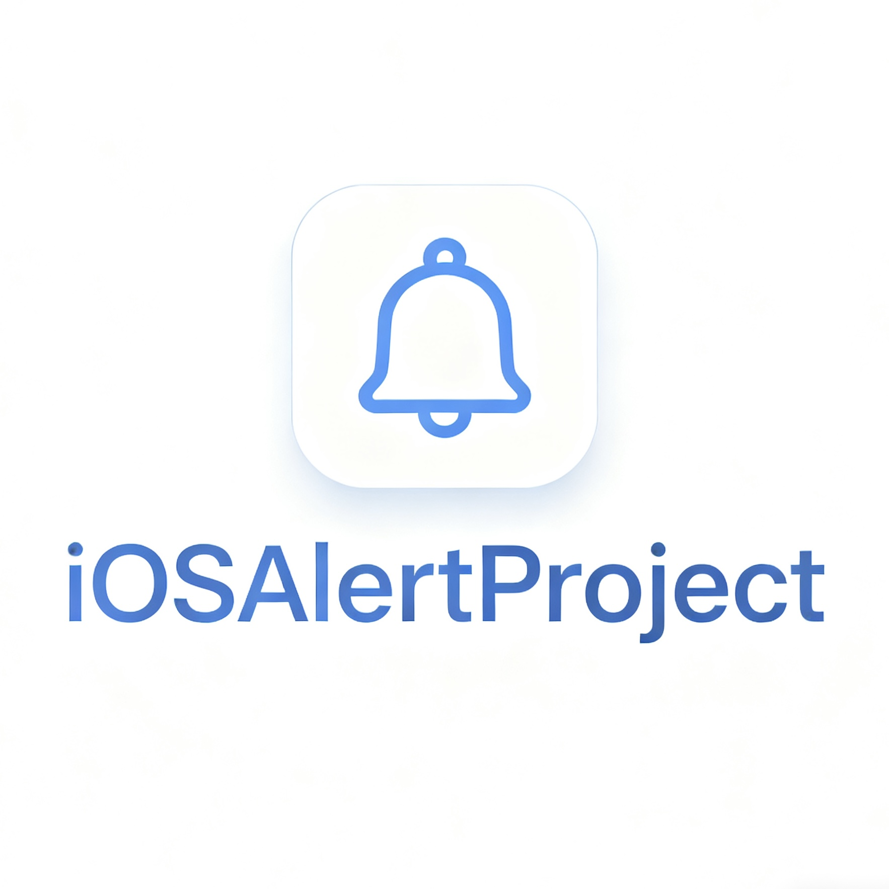

  

# iOS 彈窗項目

> English | [中文](README_ZH.md) | 繁體中文

這是一個 Theos tweak 項目，用於在 iOS 中注入原生彈窗。

**作者:** pxbug

## 項目結構
- `Tweak.x`: 包含彈窗邏輯和 hook 源碼。
- `Makefile`: 建構配置。
- `control`: 包信息。
- `iOSAlertProject.plist`: 指定要注入的應用程序（默認: SpringBoard）。

## 建構方法
1. 確保已安裝 [Theos](https://github.com/theos/theos)。
2. 在當前目錄運行 `make package`。
3. 生成的 `.deb` 文件將在 `packages/` 文件夾中。

## 自定義
- **目標應用**: 編輯 `iOSAlertProject.plist`，將 `com.apple.springboard` 改為您目標應用的 Bundle ID（例如: `com.apple.Maps`）。
- **彈窗內容**: 編輯 `Tweak.x` 來修改標題、消息或按鈕。

## 注意事項
- **沙盒權限**: 某些系統 App 或具有嚴格沙盒限制的 App 可能會阻止注入或彈窗，但在大多數普通 App 和系統 App 中應該有效。
- **重複彈窗**: 目前邏輯是每個 App 進程生命週期內只彈一次（使用 `static BOOL hasShown`）。如果殺掉 App 重啟，會再次彈窗。

---

**由 pxbug ❤️ 製作**
